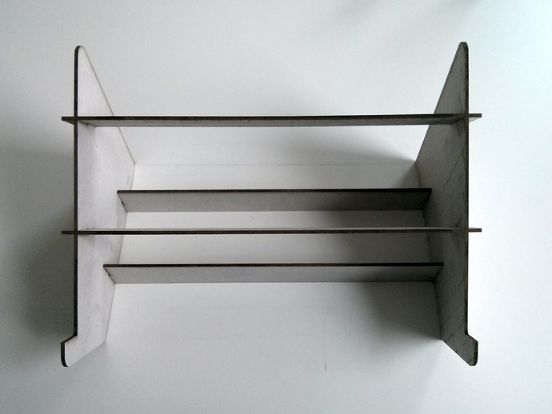
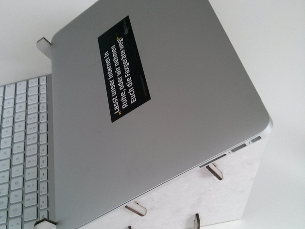

# Laser-cut DIY Laptop Stand

## Summary

Top View:

Side View:

The files here are simply a clone of `emnullfuenf`'s [Cardboard Macbook Air
Stand](http://www.thingiverse.com/thing:71405). No changes were made to the
files provided in the link.

`emnullfuenf`'s design is in turn a remix of `AndrewSleigh`'s [Laser-cut Laptop
Stand for Macbook Air](http://www.thingiverse.com/thing:22724).

## Details

**This design is made for a 384mm x 384mm x 2.8mm board**. The slots on the
design may need to be adjusted for thickness depending on the thickness of the
material that is being used.

